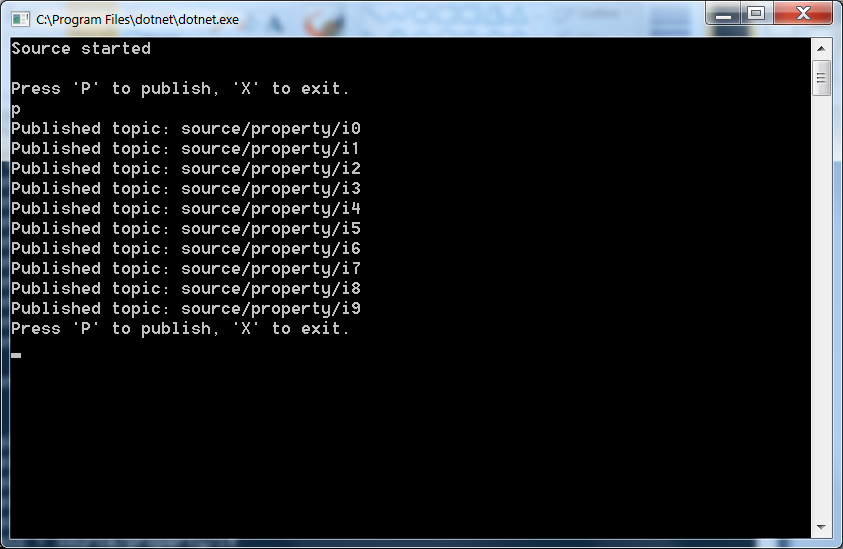

# MqttNetTest
MSVS Solution that demonstrates possible bug in MQTTNet
This project demonstrates a possible bug in MQTTNet where published messages are being dropped and the the last message is published several times. Hopefully, I'm doing something wring. If you see my error or know a better work-around, please let me know.

On line 66 of Publisher.cs is a Thread.Sleep() instruction. Increasing this values causes fewer messages from being dropped until non are dropped.

There are only 3 *.cs files, but 6 projects. This is because each file is compiled to both .NET Framework 4.5.2 and to .NET Core 2.0. My requirements are that the publisher use .NET Framework, and the subscriber use .NET Core.

To use this start the broker, publisher and subscriber. In the publisher window, press the "P" key to itereate a for-next loop to publish 10 topics quickly. In the subscriber window, you should see the last message received 10 times. The debug window shows that the last message was published 10 times.

<b>Note - </b> The i0 topic is not subscribed accidentally - i0 messages are not dropped.
<h3>Publisher Screenshot - Same for Delay or No Delay</h3>

<h3>Subscriber Screenshot - No Delay in Publisher</h3>

<h3>Subscriber Screenshot - No Delay in Publisher</h3>

<h3>Subscriber Screenshot - 200 ms Delay in Publisher</h3>

<h3>Debug Screenshot - No Delay</h3>

<h3>Debug Screenshot - No Delay</h3>

